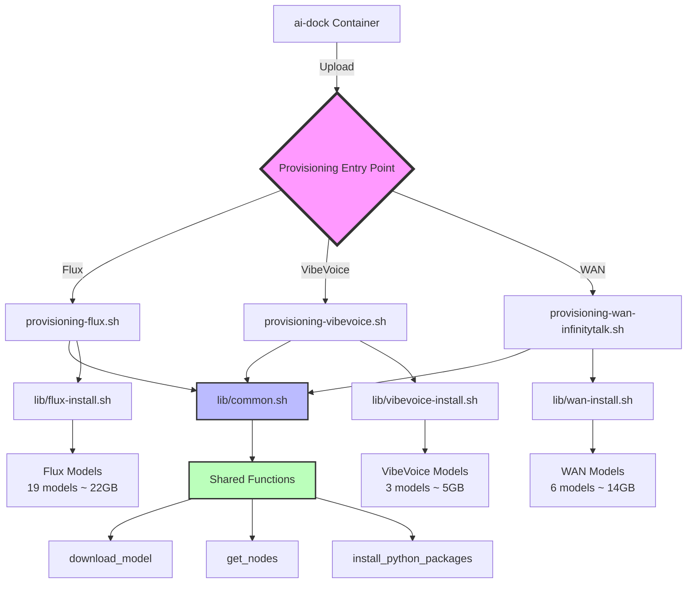
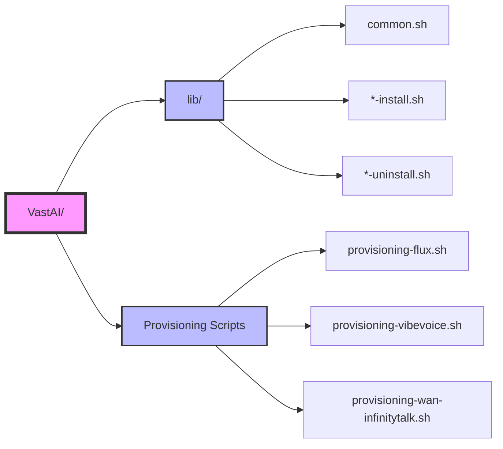
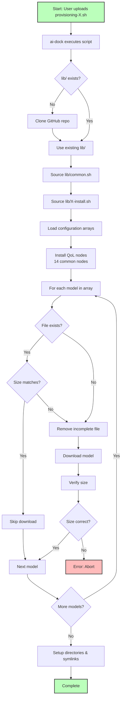
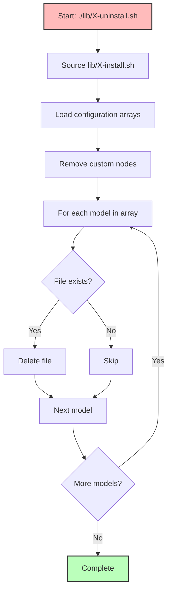
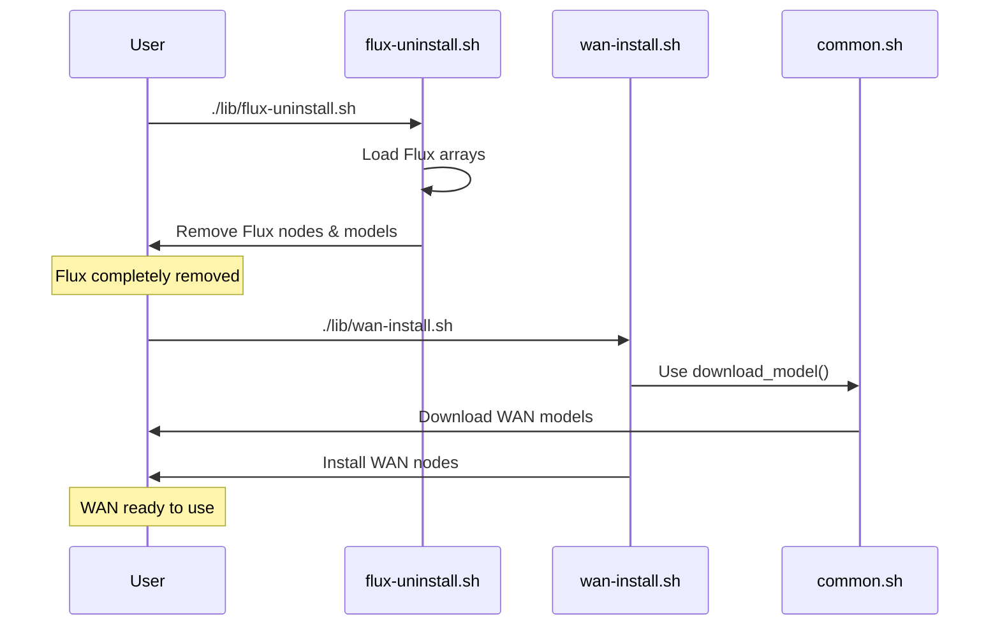
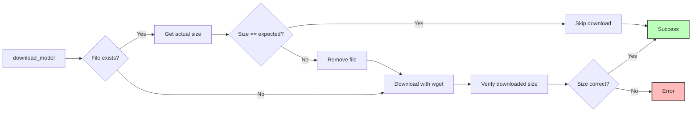
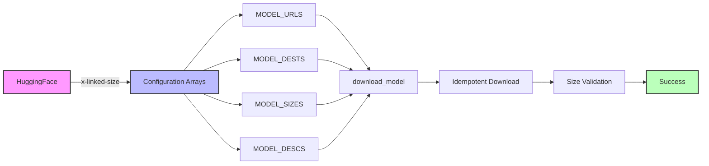
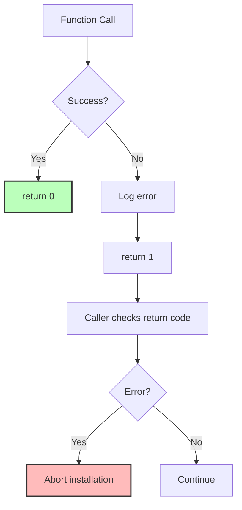

# ComfyUI Vast.AI Provisioning Scripts

## Architecture



## File Structure



## Installation Flow



## Uninstallation Flow



## Switching Setups



## Model Download Logic



## Data Flow



## Quick Reference

### Usage
```bash
# Initial provisioning (ai-dock)
# Upload: provisioning-flux.sh (or vibevoice, or wan)

# Switch setups (inside container)
cd /workspace/comfyui-scripts/VastAI
./lib/flux-uninstall.sh
./lib/wan-install.sh
```

### Model Sizes

| Setup | Size | Models | Components |
|-------|------|--------|------------|
| Flux | 22 GB | 19 | UNET, CLIP, Loras, VAE, ESRGAN |
| VibeVoice | 5 GB | 3 | TTS-Audio-Suite, VibeVoice 1.5B |
| WAN | 14 GB | 6 | WAN 2.1, InfinityTalk, Loras, VAE |

### Directory Paths

| Type | Path |
|------|------|
| Models | `/workspace/storage/stable_diffusion/models/` |
| Custom Nodes | `/opt/ComfyUI/custom_nodes/` |
| Scripts | `/workspace/comfyui-scripts/VastAI/` |

### Environment Variables (ai-dock)

- `$WORKSPACE` - Workspace root
- `$PIP_INSTALL` - Pip command with flags
- `$AUTO_UPDATE` - Auto-update toggle

## Configuration Format

```bash
# In lib/*-install.sh (top of file)
declare -a MODEL_URLS MODEL_DESTS MODEL_SIZES MODEL_DESCS

MODEL_URLS+=("https://huggingface.co/.../model?download=true")
MODEL_DESTS+=("subdir/model.safetensors")
MODEL_SIZES+=(1234567890)  # Exact bytes
MODEL_DESCS+=("Model Name - X.XX GB")
```

## Error Handling



## Maintenance

### Add Model

1. Get size: `curl -I "URL" | grep x-linked-size`
2. Edit `lib/X-install.sh`: Append to 4 arrays
3. Uninstall auto-syncs (sources install script)

### Add Setup

1. Create `lib/newsetup-install.sh` with arrays + `install_newsetup()`
2. Create `lib/newsetup-uninstall.sh` with `uninstall_newsetup()`
3. Create `provisioning-newsetup.sh` entry point

## Key Features

- ✅ **Idempotent**: Rerun = instant (skips existing)
- ✅ **Size Validation**: Detects incomplete downloads
- ✅ **Modular**: Shared `download_model()` function
- ✅ **Declarative**: Edit arrays, not code
- ✅ **Auto-sync**: Uninstall reads install arrays
- ✅ **Bandwidth Efficient**: No redundant downloads
- ✅ **Cost Efficient**: Fast reruns save cloud costs
